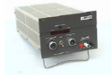
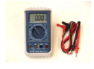
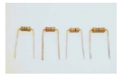
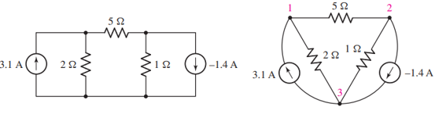
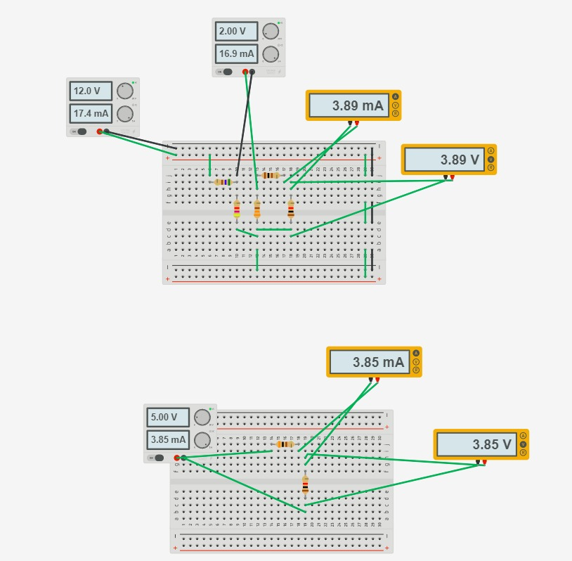
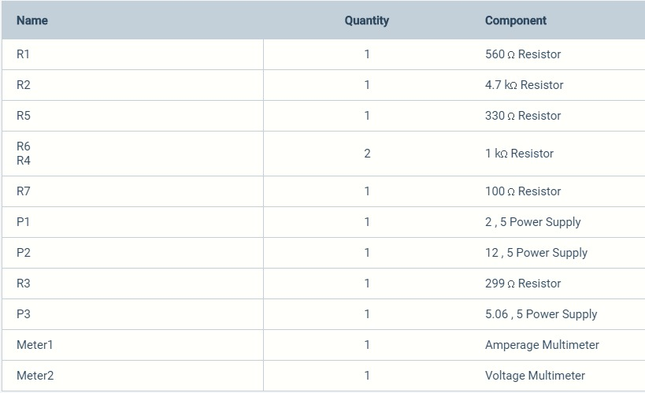

# INFORME-5
# Teorema de Thévenin

## OBJETIVOS

Comprobar experimentalmente el Teorema de Thévenin en un circuito resistivo.

**Objetivos específicos:** 
 - Identificar en el circuito las mediciones de voltajes correspondiente
   a las resistencias segun el Teorema de Thévenin.
 - Demostrar si se cumple el Teorema de Thévenin con el voltaje y la   
   corriente en el circuito propuesto.   
 - Comprobar los resultados y los datos necesarios  del  circuito 
       propuesto, demostrando el Teorema de Thévenin.
## MARCO TEÓRICO

**_Gustav Robert Kirchhoff (1824 - 1887)_**

“Se aplica a circuitos lineales con una carga que puede ser lineal o no lineal, variantes o invariantes con el tiempo cuyo estado energético sea nulo o no. Permite reemplazar un circuito de análisis complejo por uno equivalente de menos tamaño que facilite el cálculo de los efectos externos (circuito equivalente), puede usar en sistemas de potencia para analizar partes de él y reemplazando en resto del sistema de esta forma.” (Vásquez, s. f.)

<section>
      

                   
   

   </section>
  

Para mayor entendimiento de este teorema, se refiere que a cualquier circuito se le puede reducir a solo una fuente con 2 resistores, para un calculo mucho mas fácil, y para lograrlo se debe quitar el elemento a analizar y encontrar un voltaje entre los puntos donde estaba ese elemento y la resistencia equivalente de los demás elementos del circuito, para el calculo de resistencia equivalente las fuentes de tensión se convierten en cortocircuitos y las de corriente en circuitos abiertos. Así con esos 2 valores denominados Resistencia de Thévenin (RTH) y voltaje de Thévenin (VTH) para esa resistencia equivalente conseguida y ese voltaje de los puntos a y b respectivamente. Una vez con esos datos se vuelve a introducir el elemento en cuestión a calcular y re desarrolla el circuito

## **DESCRIPCIÓN DE LOS EQUIPOS Y MATERIALES**

**Fuente de voltaje C.D.** Es de donde conseguir electricidad para el circuito
<section>
      

                   
   

   </section>
   
**Multímetro digital**. Nos ayudara para poder hacer las mediciones de la practica
</section>
      

                   
   

   </section>

**Resistores** de 1kΩ, 2.2kΩ, 1.8kΩ y 3.9kΩ. Los utilizaremos para crear el circuito que vamos a medir
</section>
      

                   
   

   </section>

**Protoboard.** Es la base en la cual se va a formar el circuito con los elementos de este.
</section>
      

                   
   

   </section>

## **PROCEDIMIENTO**

Arme el circuito que se muestra en la figura 1.1.
</section>
      

                   
   

   </section>

Mida el voltaje y corriente en cada uno de los elementos del circuito. Anote los resultados de las mediciones en la tabla
Resultados obtenidos de voltaje y corriente, en cada elemento del circuito.

***Tabla 5.1. Valores del Circuito Equivalente de Thévenin.***
|             |VTH(V)           |RTH(Ω)|
|-------------|-----------------|---------------------|
|**Calculado**|5.05[V]          |298[Ω]|
|**Medido**   |5.06[V]          |299[Ω]|

***Tabla 5.2. Comprobación del Teorema de Thévenin.***
|Parámetro Eléctrico| Circuito Original||Circuito Equivalente de Thévenin Eléctrico||
|-------------------|--------------|---|-------------------------------------------|---|
|                   |**Calculado** |**Medido**|**Calculado**|**Medido**|
|**Voltaje (V)**    |3.89[V]       |3.89[V]      |3.89[V]      |3.85[V] |
|**Corriente (mA)** |3.89[mA]      |3.89[mA]      |3.89[mA]     |3.85[mA] |

## **DIAGRAMAS**
<section>
      

                   
   

   </section>
   
## **LISTA DE COMPONENTES**

 </section>
      

                   
   

   </section>

## **CONCLUSIONES**

Con esta práctica se pudo adquirir los conocimientos teóricos de lo que son las resistencias,

su tipo y su clasificación de acuerdo al circuito montado que son en serio o paralelo.

Deducimos según ley de Kirchhoff que expone que cuando en un circuito intervienen dos o más fuentes de corriente, además de ramificaciones estamos en presencia de una red eléctrica. Para que resolvamos una red eléctrica es necesario realizar un proceso en el cual calculamos las intensidades de corrientes que circulan por cada rama, conocidas las características de todos los elementos ubicados en la red.

Para el análisis completo de un circuito eléctrico requiere conocer la corriente que fluye en cada una de sus ramas para lo cual usamos la ley de corriente y ley de voltaje de Kirchhoff y para establecer ecuaciones que relacionan las corrientes y necesitamos tantas ecuaciones lineal mente independientes como ramas hay a fin de asegura que podemos obtener las soluciones del sistema.

La regla de la corriente no es suficiente para efectuar el análisis completo de algún circuito, lo mejor es escribir tantas ecuaciones como sea posible para los nodos y luego aumentarlas con ecuaciones obtenidas a partir de los bucles; de lo cual resulta mejor escoger el bucle con el menor número de elementos de circuito lo cual hace que en lo posterior los procedimientos algebraicos se simplifiquen.

Las leyes de Kirchhoff han sido una gran ayuda para la innovación tecnológica ya que han permitido medir con exactitud ciertas características eléctricas necesarias para que el invento funcione óptima mente.

## **RECOMENDACIONES**

Se establecen en función del proyecto y constituyen la base para un funcionamiento adecuado.

## **CRONOGRAMA**

 </section>
      

                   
   

   </section>
  

  

# **BIBLIOGRÁFICA**

William H. Hayt, J., Kemmerly, J. E., & Durbin, S. M. (2012). Análisis de circuitos en ingenieria. Buffalo: Mc Graw Hill.
Vásquez, J. R. G. (s. f.). TEOREMAS FUNDAMENTALES DE CIRCUITOS ELÉCTRICOS. 251.

## **ANEXOS**

https://github.com/fernandoSando/Informe/tree/master/Anexos

 
