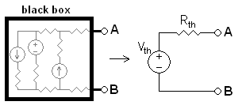
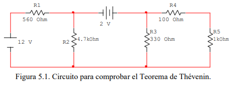
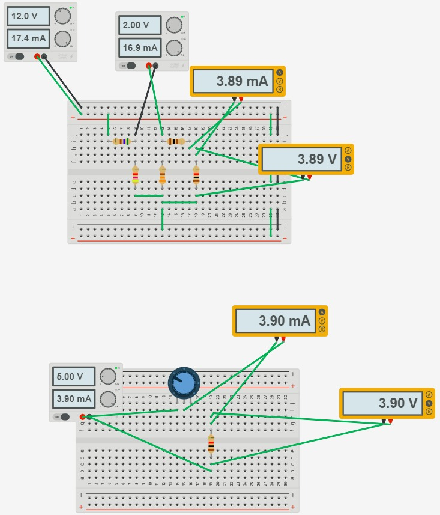

# INFORME-5
# Teorema de Thévenin

## OBJETIVOS

Comprobar experimentalmente el Teorema de Thévenin en un circuito resistivo.

**Objetivos específicos:** 
 - Identificar en el circuito las mediciones de voltajes correspondiente
   a las resistencias segun el Teorema de Thévenin.
 - Demostrar si se cumple el Teorema de Thévenin con el voltaje y la   
   corriente en el circuito propuesto.   
 - Comprobar los resultados y los datos necesarios  del  circuito 
       propuesto, demostrando el Teorema de Thévenin.
## MARCO TEÓRICO

“Se aplica a circuitos lineales con una carga que puede ser lineal o no lineal, variantes o invariantes con el tiempo cuyo estado energético sea nulo o no. Permite reemplazar un circuito de análisis complejo por uno equivalente de menos tamaño que facilite el cálculo de los efectos externos (circuito equivalente), puede usar en sistemas de potencia para analizar partes de él y reemplazando en resto del sistema de esta forma.” (Vásquez, s. f.)

<section>
      

                   
   

   </section>
  

Para mayor entendimiento de este teorema, se refiere que a cualquier circuito se le puede reducir a solo una fuente con 2 resistores, para un calculo mucho mas fácil, y para lograrlo se debe quitar el elemento a analizar y encontrar un voltaje entre los puntos donde estaba ese elemento y la resistencia equivalente de los demás elementos del circuito, para el calculo de resistencia equivalente las fuentes de tensión se convierten en cortocircuitos y las de corriente en circuitos abiertos. Así con esos 2 valores denominados Resistencia de Thévenin (RTH) y voltaje de Thévenin (VTH) para esa resistencia equivalente conseguida y ese voltaje de los puntos a y b respectivamente. Una vez con esos datos se vuelve a introducir el elemento en cuestión a calcular y re desarrolla el circuito

## **DESCRIPCIÓN DE LOS EQUIPOS Y MATERIALES**

**Fuente de voltaje C.D.** Es de donde conseguir electricidad para el circuito
<section>
      

                   
   

   </section>
   
**Multímetro digital**. Nos ayudara para poder hacer las mediciones de la practica
</section>
      

                   
   

   </section>

**Resistores** de 1kΩ, 100Ω, 330Ω, 4.7kΩ y 560Ω. Los utilizaremos para crear el circuito que vamos a medir
</section>
      

                   
   

   </section>

**Protoboard.** Es la base en la cual se va a formar el circuito con los elementos de este.
</section>
      

                   
   

   </section>

## **PROCEDIMIENTO**

Arme el circuito que se muestra en la figura 5.1.

</section>
      

                   
   

   </section>

 Mida el voltaje y la corriente en el resistor R5, anote los resultados en la tabla 5.2.
 
 Desconecte el resistor R5 y mida el voltaje en el circuito abierto. Anote el valor
medido en la tabla 5.1.

Anule el efecto de las fuentes de alimentación. Desconecte R5 y desde el circuito
abierto resultante mida la resistencia equivalente. Anote el valor medido en la tabla 5.1.

 Implemente el circuito equivalente de Thévenin, agregue el resistor R5 y mida la
corriente y el voltaje en el mismo, anote los resultados en la tabla 5.2.

***Tabla 5.1. Valores del Circuito Equivalente de Thévenin.***
|             |VTH(V)           |RTH(Ω)|
|-------------|-----------------|---------------------|
|**Calculado**|5.05[V]          |298[Ω]|
|**Medido**   |5.06[V]          |299[Ω]|

***Tabla 5.2. Comprobación del Teorema de Thévenin.***
|Parámetro Eléctrico| Circuito Original||Circuito Equivalente de Thévenin Eléctrico||
|-------------------|--------------|---|-------------------------------------------|---|
|                   |**Calculado** |**Medido**|**Calculado**|**Medido**|
|**Voltaje (V)**    |3.89[V]       |3.89[V]      |3.89[V]      |3.85[V] |
|**Corriente (mA)** |3.89[mA]      |3.89[mA]      |3.89[mA]     |3.85[mA] |

## **DIAGRAMAS**
<section>
      

                   
   

   </section>
   
## **LISTA DE COMPONENTES**

 </section>
      

                   
   

   </section>

## **CONCLUSIONES**

El teorema de Thévenin se basa en el análisis de los circuitos con el propósito de poder encontrar el voltaje de un circuito abierto, hallando matemáticamente y experimental los valores correspondientes, que consiste, que el valor de las resistencias puede ser reemplazada o sustituida por otra fuente de tensión.

En conclusión, emplear el teorema de Thévenin resulta practico para reducir componentes, aparte de considerar la comprobación de los resultados mediante un simulador y evidenciar que el porcentaje de error es mínimo.

Al acabar la simulación, se concluye que todo circuito lineal activo puede ser reducido por un circuito equivalente serie (Thévenin), confirmando  su utilidad.

## **RECOMENDACIONES**

Se establecen en función del proyecto y constituyen la base para un funcionamiento adecuado.

## **CRONOGRAMA**

 </section>
      

                   
   

   </section>
  

  

# **BIBLIOGRÁFICA**

William H. Hayt, J., Kemmerly, J. E., & Durbin, S. M. (2012). Análisis de circuitos en ingenieria. Buffalo: Mc Graw Hill.
Vásquez, J. R. G. (s. f.). TEOREMAS FUNDAMENTALES DE CIRCUITOS ELÉCTRICOS. 251.

## **ANEXOS**
https://github.com/fernandoSando/informe-5/tree/master/Anexos
 
